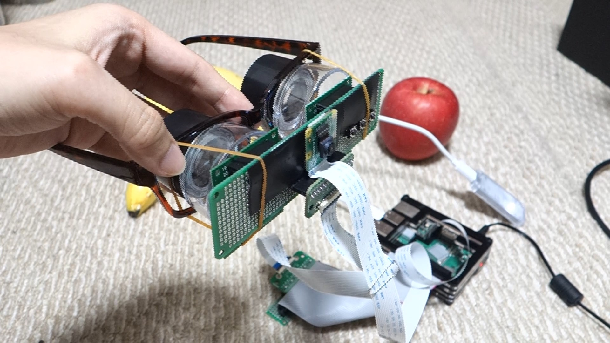
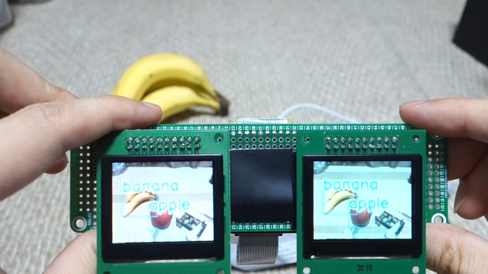
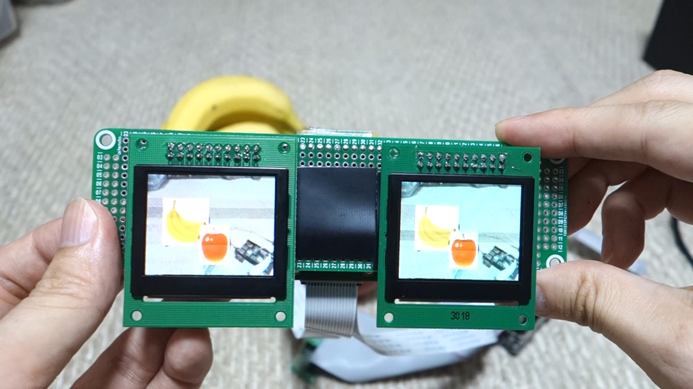
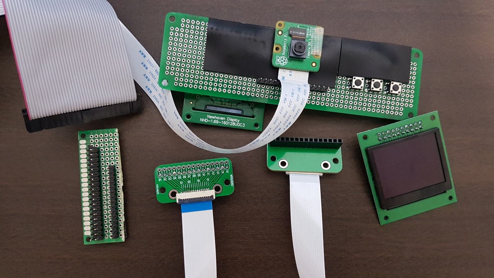

# Home-built AR Smart Glasses using Edge TPU and Raspberry Pi

This is a project to create AR smart glasses using Edge TPU and Raspberry Pi 3 (This is a joke gadget, of course!).

- Object detection (COCO 90 classes using MobileNet V2 SSD)
- Display detection results:
	- bounding boxes on liveview
	- overlay icons on liveview
	- icons only

 
 
 
 

## Hardware
- Raspberry Pi 3 Model B+ (Raspbian Buster)
- Pi Camera V2.1
- Google Coral Edge TPU (USB Accelerator)
- Full color OLED x 2
	- 160 x 128
	- NHD-1.69-160128UGC3
	- SEPS525 controller
- Others
	- Buttons
	- FFC 1.0mm/15pin
		- Cable (the same as Pi Camera, which means I have lots of options for FFC cable)
		- Connector (下接点)
		- Breakout board (convert FFC to 2.54mm)

### Connection (Pi-Camera)
- As always, just use FFC cable

### Connection (Pi-Display)
- Make a small breakout board to convert Pi 40pin to FFC 15pin
- Make another breakout board to mount two OLEDs and buttons

```
01: VDD
02: GND
03: DC  (GPIO4)
04: SCL
05: SDI
06: RES (GPIO5)
07: CS
08: BTN1 (GPIO23)
09: BTN2 (GPIO24)
10: BTN3 (GPIO25)
11: 
12: 
13: 
14: 
15: 
```

 

## Software
- smart_glasses.py
	- main application
	- generates five threads
		- CAPTURE: to capture camera image using OpenCV (use GStreamer to decrease latency)
			- send captured image to DETECTION and DISPLAY thread
		- DETECTION: to detect objects using Edge TPU engine
			- send detection results to DISPLAY
		- DISPLAY: to display image to OLED using OLED_SEPS525_SPI_BGR565 module
			- has three displaymodes:
				- mode1: draw bounding boxes
				- mode2: overlay icons
				- mode3: display icons only
		- CONTROLLER_KEYBOARD: to get user input via keyboard
		- CONTROLLER_KEYBOARD: to get user input via button (GPIO)
- OLED_SEPS525_SPI_BGR565.py
	- sub module to control Full color OLED using SPI
- label_coco.py
	- labels for COCO (mobilenet_ssd_v2_coco_quant_postprocess_edgetpu.tflite)
- icons/*.jpg
	- icon images for overlay (retrieved from いらすとや)

## How to start
- Install Edge TPU
- Install OpenCV
	- if you don't use GStreamer, may need to modify VideoCapture part in smart_glasses.py
- Get MobileNet V2 SSD model from Google Coral site
	- `wget https://dl.google.com/coral/canned_models/mobilenet_ssd_v2_coco_quant_postprocess_edgetpu.tflite`
- Run the script
	- `sudo python3 smart_glasses.py`


## Note
- Need the following commands to use Edge TPU on Raspbian Buster (Python3.7)

```
cd /usr/local/lib/python3.7/dist-packages/edgetpu/swig/
sudo ln -s _edgetpu_cpp_wrapper.cpython-35m-arm-linux-gnueabihf.so _edgetpu_cpp_wrapper.cpython-37m-arm-linux-gnueabihf.so
```

- To start the application automatically on boot. This scripts set cron configuration

```
convvert CRLF to LF in autorun.sh and install.sh
sudo sh ./install.sh
```
